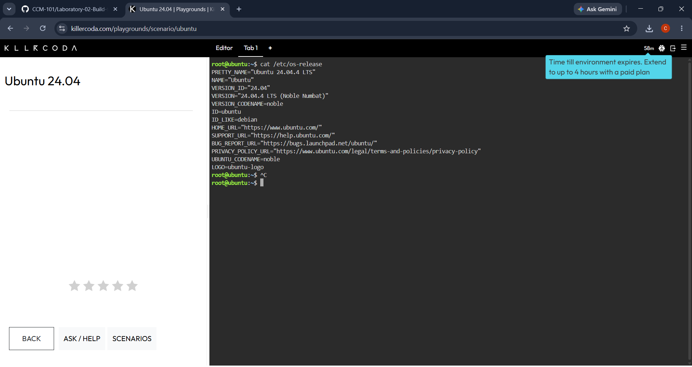
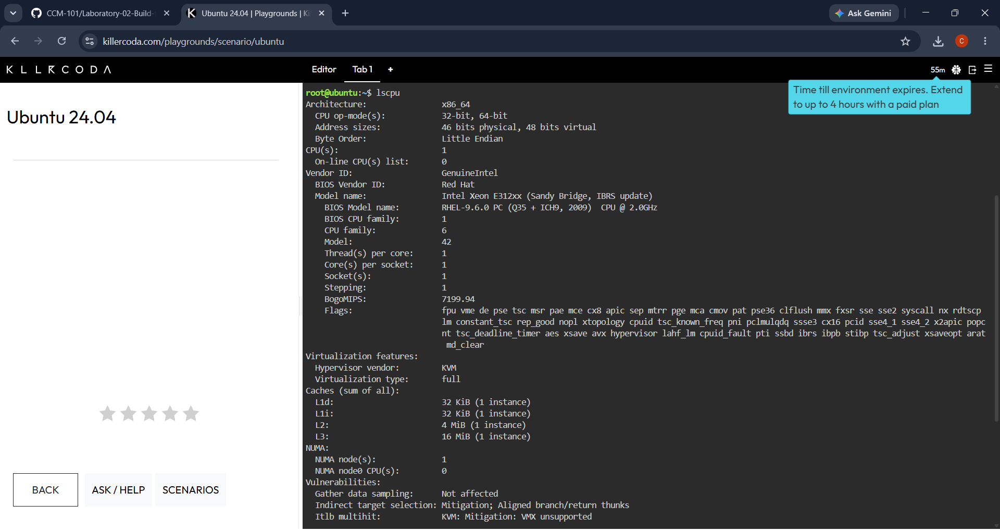
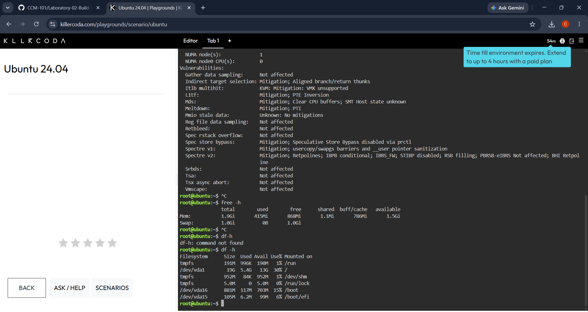
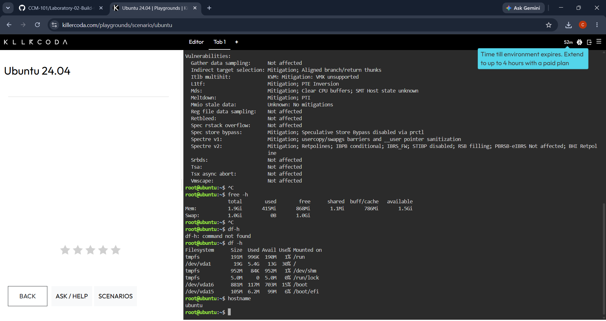

## Checkpoint 7 – Continue Your Linux Investigation

### Linux Server Investigation

A Linux server was investigated using the KillerCoda Playground and standard Linux commands. The purpose of the investigation was to identify the server's operating system, CPU information, memory, and disk space.

### Operating System

Command used: `cat /etc/os-release`

This command was used to identify the operating system and version running on the Linux server.

### CPU Information

Command used: `lscpu`

This command was used to identify the CPU architecture, processor information, and number of CPUs.

### Memory

Command used: `free -h`

This command was used to identify the total, used, and available memory of the Linux server.

### Disk Space

Command used: `df -h`

This command was used to identify the total disk capacity, used space, available space, and mounted file systems.

### Cloud Migration Options

If this Linux server were migrated to the cloud, it could be hosted using virtual machine services from AWS, Microsoft Azure, or Google Cloud.

| Cloud Provider | Cloud Service | Purpose |
|---|---|---|
| AWS | Amazon EC2 | Hosts the Linux server as a virtual machine |
| Microsoft Azure | Azure Virtual Machines | Hosts and runs the Linux server |
| Google Cloud | Compute Engine | Hosts the Linux server as a virtual machine |

All three cloud providers support Linux virtual machines. The appropriate service can be selected based on the server's CPU, memory, storage, operating system, workload, cost, scalability, and networking requirements.

### Conclusion

The Linux investigation showed how basic Linux commands can be used to identify important server resources such as the operating system, CPU, memory, and disk space. These details are useful when planning a cloud migration because they help determine the appropriate virtual machine configuration. AWS EC2, Azure Virtual Machines, and Google Compute Engine can all be used to host the Linux server in the cloud.
