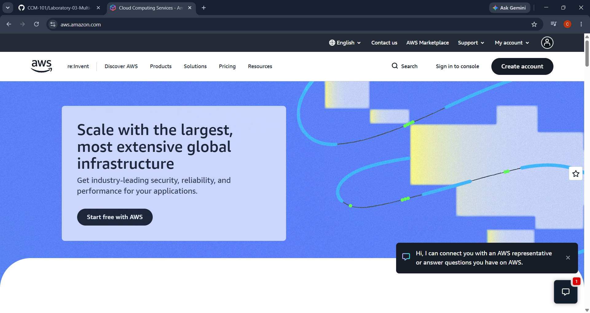

# Amazon Web Services (AWS) Research

## 1. Brief Overview

Amazon Web Services (AWS) is a cloud computing platform provided by Amazon. It offers a wide range of cloud services that organizations can use to build, deploy, and manage applications without maintaining all of their own physical infrastructure. AWS provides services for computing, storage, databases, networking, security, analytics, artificial intelligence, and many other workloads.

## 2. Global Infrastructure

AWS operates a global cloud infrastructure organized into Regions and Availability Zones. An AWS Region is a separate geographic area, while Availability Zones are isolated locations within a Region. This infrastructure allows organizations to deploy applications closer to their users and design systems for high availability and fault tolerance. AWS also provides Local Zones and Wavelength Zones for workloads that require resources closer to end users or specific networks.

## 3. Cloud Management Console

The AWS Management Console is a web-based interface used to access and manage AWS services. It provides centralized access to individual AWS service consoles and allows users to search for services, manage resources, view notifications, access CloudShell, and manage account information.

## 4. Four Core Services

### Amazon EC2

Amazon Elastic Compute Cloud (Amazon EC2) provides virtual servers that can be used to run applications and workloads in the AWS cloud.

### Amazon S3

Amazon Simple Storage Service (Amazon S3) is an object storage service used to store and retrieve files, data, backups, and other objects.

### Amazon RDS

Amazon Relational Database Service (Amazon RDS) makes it easier to set up, operate, and scale relational databases in the cloud.

### Amazon VPC

Amazon Virtual Private Cloud (Amazon VPC) allows users to create a logically isolated network environment where AWS resources can be deployed securely.

## 5. Three Advantages

1. **Wide range of services** – AWS provides many services for computing, storage, networking, databases, security, analytics, and other technologies.
2. **Global infrastructure** – AWS provides Regions and Availability Zones around the world, allowing organizations to deploy applications in locations appropriate for their users and requirements.
3. **Scalability and flexibility** – Organizations can increase or decrease cloud resources according to their workload requirements.

## 6. Typical Enterprise Use Cases

AWS is commonly used by enterprises for web and mobile applications, data storage and backup, database hosting, software development, disaster recovery, analytics, and large-scale business applications. Organizations can combine multiple AWS services to build highly available and scalable systems.

## 7. Screenshot

*Figure 1. AWS official homepage.*
