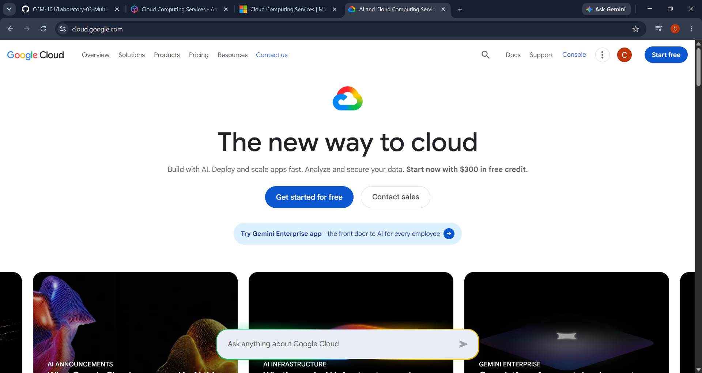

# Google Cloud Platform (GCP) Research

## 1. Brief Overview

Google Cloud Platform (GCP), also known as Google Cloud, is a cloud computing platform provided by Google. It provides services for computing, storage, databases, networking, data analytics, artificial intelligence, machine learning, and application development. Organizations can use Google Cloud to build, deploy, and scale applications and infrastructure using Google's cloud infrastructure.

## 2. Global Infrastructure

Google Cloud operates infrastructure across geographic regions and zones around the world. A region is a geographic area that contains multiple zones, while zones are locations within a region that provide isolation from certain infrastructure failures. Organizations can distribute resources across regions and zones to improve availability, reliability, and performance.

## 3. Cloud Management Console

The Google Cloud Console is a web-based interface used to manage Google Cloud resources and services. Users can use the console to create and configure resources, monitor applications, manage projects, and access different Google Cloud services. Google Cloud resources can also be managed using the Google Cloud CLI and APIs.

## 4. Four Core Services

### Compute Engine

Compute Engine is an infrastructure-as-a-service platform that provides virtual machines running on Google's infrastructure. It can be used to host applications, websites, databases, and other workloads.

### Cloud Storage

Cloud Storage is an object storage service used to store and retrieve data such as files, backups, media, and application data.

### Cloud SQL

Cloud SQL is a managed relational database service that supports database systems such as MySQL, PostgreSQL, and SQL Server.

### Google Kubernetes Engine

Google Kubernetes Engine (GKE) is a managed Kubernetes service used to deploy, manage, and scale containerized applications.

## 5. Three Advantages

1. **Strong AI and machine learning capabilities** – Google Cloud provides a wide range of services and infrastructure for artificial intelligence and machine learning workloads.
2. **Kubernetes expertise** – Google Cloud provides Google Kubernetes Engine (GKE), a managed Kubernetes platform for containerized applications.
3. **Global infrastructure** – Google Cloud provides regions and zones around the world, allowing organizations to deploy workloads closer to users and distribute resources for improved reliability.

## 6. Typical Enterprise Use Cases

Google Cloud is commonly used for artificial intelligence and machine learning, data analytics, big data processing, web applications, containerized applications, databases, infrastructure hosting, and global digital services. Enterprises can combine services such as Compute Engine, Cloud Storage, BigQuery, Cloud SQL, and Google Kubernetes Engine to create scalable cloud solutions.

## 7. Screenshot

*Figure 1. Google Cloud official homepage.*
